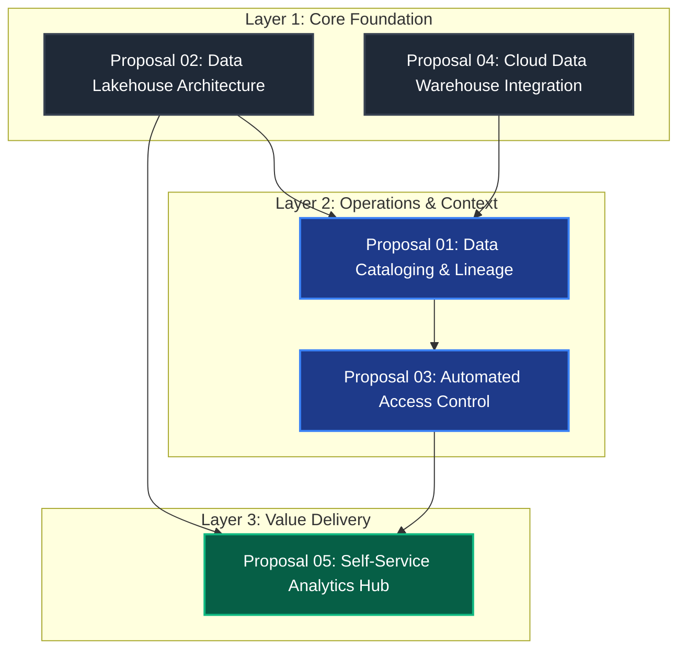

Here is a complete, production-ready template for your homepage (docs/index.md).
It provides an institutional executive summary layout, a native Mermaid diagram tracking proposal dependencies, and visual "admonition" callout boxes to give your strategy a polished, professional look immediately.

# 🏛️ Institutional Data Strategy
Welcome to the central repository for the institutional data strategy. This platform serves as a living roadmap, housing our interconnected technical proposals, architectural patterns, and data governance frameworks. 

!!! note "Target Audience"
    This documentation is open to all institutional stakeholders. Modifications, proposal additions, and architectural reviews are handled exclusively by the technical engineering and data teams via GitHub Pull Requests.
---## 🗺️ Master Strategic Roadmap
The flowchart below maps our current proposals and shows how they depend on one another. Click on any section in the sidebar menu to view the full technical implementation plan for that specific proposal.

---## 📋 Active Strategic Proposals
| Proposal ID | Title | Domain | Current Status | Primary Contact |
| :--- | :--- | :--- | :--- | :--- |
| **P-01** | Data Cataloging & Lineage | Governance | 🟡 Under Review | @data-gov-team |
| **P-02** | Data Lakehouse Architecture | Infrastructure | 🟢 Approved | @platform-eng |
| **P-03** | Automated Access Control | Security | 🔴 Draft | @infosec |
| **P-04** | Cloud Data Warehouse | Infrastructure | 🟢 Approved | @platform-eng |
| **P-05** | Self-Service Analytics Hub | Business Value | 🟡 Under Review | @bi-team |
---## 🛠️ Contribution Workflow
Because we practice **Docs-as-Code**, any changes to this strategy must follow standard developer workflows:

1. **Fork/Branch:** Create a new feature branch from `main` (e.g., `feature/proposal-06-api-mesh`).
2. **Write:** Author your proposal in standard Markdown under the appropriate directory (`/docs/architecture/` or `/docs/governance/`).
3. **Visualize:** Embed architectural relationships natively using standard ```mermaid syntax blocks.
4. **Register:** Add your file path to the `nav` section in the root `mkdocs.yml` file.
5. **Submit:** Open a **Pull Request (PR)** against the `main` branch. 

!!! success "Automated Validation & Deployment"
    Once your PR is reviewed and merged into `main`, a GitHub Actions runner will automatically build, test, and re-publish the updated data strategy to our live site within two minutes.

## 💡 Pro-Tip for Navigation
To view how this page fits dynamically within your site sidebar and top tabs, make sure your root mkdocs.yml navigation block matches this layout:

nav:
  - Home: index.md
  - Data Governance:
    - Overview: governance/index.md
    - Proposal 01 - Cataloging: governance/cataloging.md
  - Infrastructure & Architecture:
    - Overview: architecture/index.md
    - Proposal 02 - Data Lakehouse: architecture/lakehouse.md

If you want to customize this further, let me know:

* Do you want help writing a template file for individual proposals (e.g., cataloging.md) with standard sections like abstract, budget, and architecture?
* Would you like to adjust the color theme of the site to match your institution's branding?


